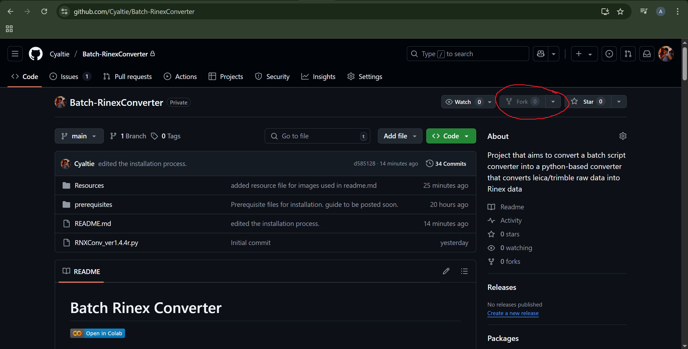

# 🤝 Collaborator Guide: How to Work on This Repository

This guide is for contributors who want to propose changes to this repository, especially if you're starting from a ZIP download. It includes setup instructions, update syncing, and how to resume work after rebooting your system.

---

## 📂 Local Installation

### 1. Make sure Git is installed  
- Install Git following this YouTube guide (from 2:11 to 3:13):  
  [](https://youtu.be/tRZGeaHPoaw?si=NV-0TO8qYmWDUhnu&t=131)

### 2. Download the repository  
- Click **Code > Download ZIP** in the GitHub repo.  
    
- Unzip it to:  
  `C:/Users/<YourName>/Batch-RinexConverter`  
  

---
## 🔱 Creating a fork branch in GitHub
- To avoid having conflicts with the main branch (where owner is working), each collaborator is recommended to create their own fok of the github repo.
### 1. Go to the main repo page.
-  click on the **Fork** on the top-right corner.
    <br>

This creates a copy of the repository under your own github account.

## 🔧 First-Time Git Setup

### 1. Open Git Bash and configure Git [only once] (do it line-by-line)  
```bash
git config --global user.name "Your Name"
git config --global user.email "your-email@example.com"
```

### 2. Navigate to the repo folder and initialize Git (do it line-by-line)

```bash
cd C:/Users/<YourName>/Batch-RinexConverter
git init
```

### 3. Add remote connections (do it line-by-line)
Replace with your GitHub username and repo name.
```bash
git remote add origin https://github.com/<your-username>/<repo-name>.git
git remote add upstream https://github.com/<owner-username>/Batch-RinexConverter.git
```
### 4. Verify that the remotes are set
```bash
git remote -v
```
Expected output should be something like this:
```bash
origin   https://github.com/<your-username>/<repo-name>.git (fetch)
origin   https://github.com/<your-username>/<repo-name>.git (push)
upstream https://github.com/Cyaltie/Batch-RinexConverter.git (fetch)
upstream https://github.com/Cyaltie/Batch-RinexConverter.git (push)
```

## 🌿 Creating a Branch and Making Changes
- 