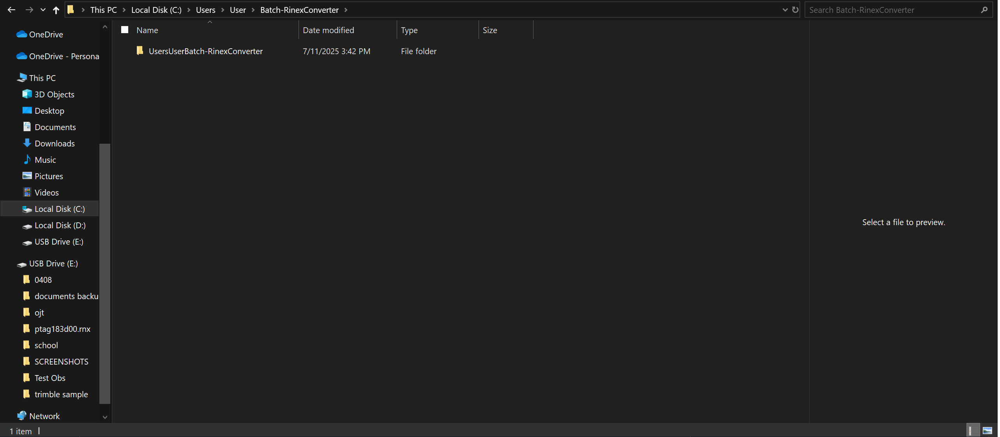
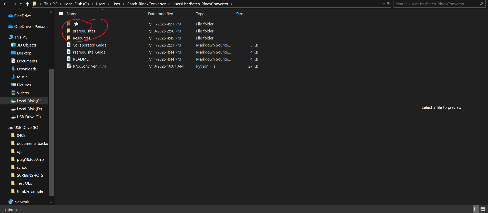
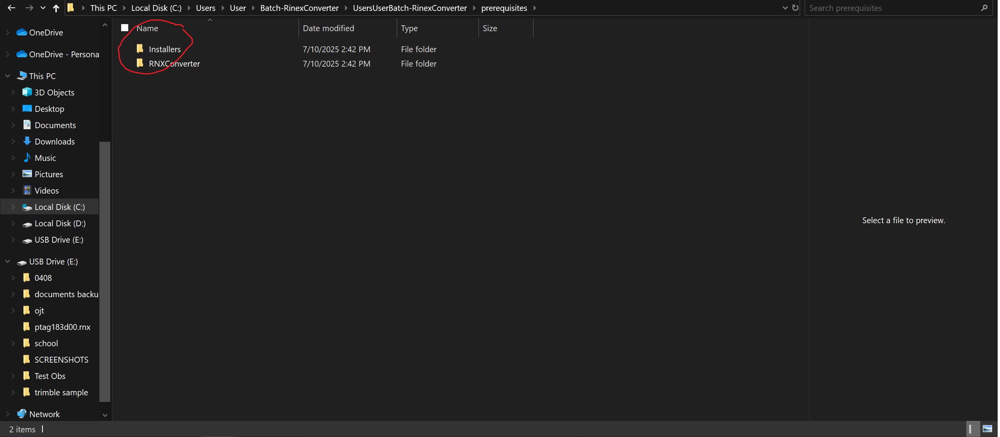
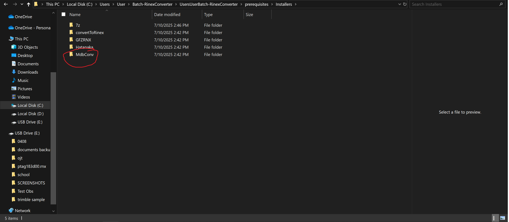
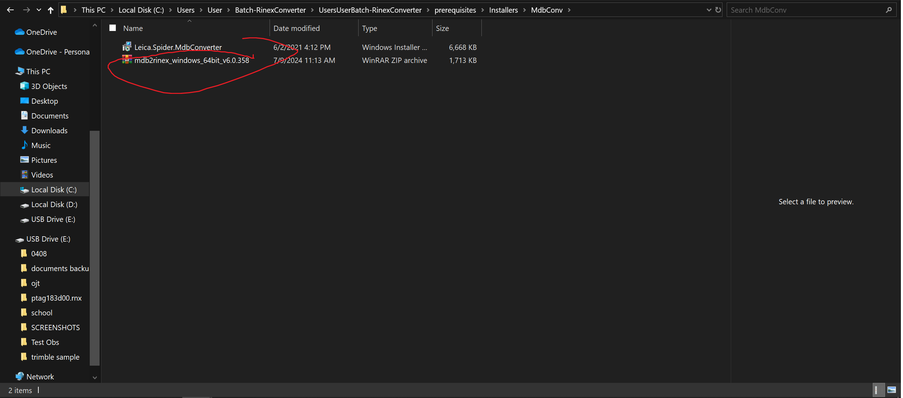
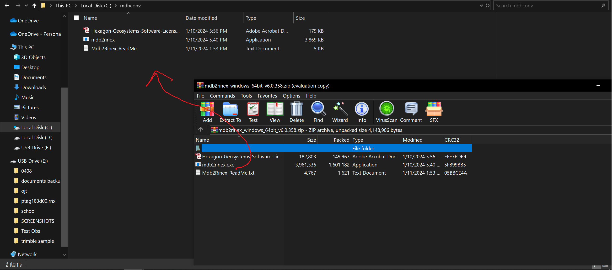

# Prerequisite Guide: Code dependencies

This guide is so the code will execute properly. Once you finish this guide. Theoretically, you would be in the same page as me.

---

## 📑 Table of Contents

- [🔁 MdbConverter install](#-mdbconverter-install)
- [📂 7z install](#-7z-install)
- [🔱 ConvertToRinex install](#-converttorinex-install)
- [🔧 GFZRNX Install](#-gfzrnx-install)
- [🌿 Hatanaka install](#-hatanaka-install)


## 🔁 MdbConverter install  

[⬆️ Back to Top](#-collaborator-guide-how-to-work-on-this-repository)

### 1. Extract mdb2rinex.exe in mdb2rnx folder  
- open your local git repo in windows file explorer. it should be in `C:/Users/<YourName>/Batch-RinexConverter/UsersUserBatch-RinexConverter`  



- go to the prerequisites folder and open the installers folder.
  
  

- open MdbConv folder and open the included zip file


- open File Explorer. Go to your C drive and create a folder named "MdbConv"


- Extract the mdb2rinex.exe into the MdbConv in C drive by dragging the exe into the folder


---
## 📂 7z install  

[⬆️ Back to Top](#-collaborator-guide-how-to-work-on-this-repository)

- To avoid having conflicts with the main branch (where owner is working), each collaborator is recommended to create their own fok of the github repo.
### 1. Go to the main repo page.
-  click on the **Fork** on the top-right corner.
    <br>

This creates a copy of the repository under your own github account.

## 🔱 ConvertToRinex install  

[⬆️ Back to Top](#-collaborator-guide-how-to-work-on-this-repository)

### 1. Open Git Bash and configure Git [only once] (do it line-by-line)  
```bash
git config --global user.name "Your Name"
git config --global user.email "your-email@example.com"
```

### 2. Navigate to the repo folder and initialize Git (do it line-by-line)

```bash
cd C:/Users/<YourName>/Batch-RinexConverter
git init
```

### 3. Add remote connections (do it line-by-line)
Replace with your GitHub username and repo name.
```bash
git remote add origin https://github.com/<your-username>/<repo-name>.git
git remote add upstream https://github.com/<owner-username>/Batch-RinexConverter.git
```
### 4. Verify that the remotes are set
```bash
git remote -v
```
Expected output should be something like this:
```bash
origin   https://github.com/<your-username>/<repo-name>.git (fetch)
origin   https://github.com/<your-username>/<repo-name>.git (push)
upstream https://github.com/Cyaltie/Batch-RinexConverter.git (fetch)
upstream https://github.com/Cyaltie/Batch-RinexConverter.git (push)
```

## 🔧 GFZRNX Install  

[⬆️ Back to Top](#-collaborator-guide-how-to-work-on-this-repository)

### 1. Create a new feature branch
```bash
git checkout -b my-feature-branch
```
### 2. Make edits in the folder

### 3. Stage and commit your changes
- if you want all the files to be updated in your github fork: (**do this line by line**)
```bash
git add .
git commit -m "Describe your changes"
```
- if you want to update a single file (say the python code) (**do this line by line**)
```bash
git add /path of file or folder
git commit -m "Describe your changes"
```

sample (edited python code)
```bash
git add /C:/Users/User/Batch-RinexConverter/UsersUserBatch-RinexConverter/RNXConv_1.4.5r.py
git commit -m "added logging interval functionality"
```

### 4. Push to your fork
```bash
git push -u origin my-feature-branch
```

## 🌿 Hatanaka install  

[⬆️ Back to Top](#-collaborator-guide-how-to-work-on-this-repository)
### 1. Go to your fork on GitHub

### 2. Click “Compare & pull request”

### 3. Confirm:

Base repo = Cyaltie/Batch-RinexConverter

Compare branch = your feature branch

### 4. Add a description and click “Create pull request”