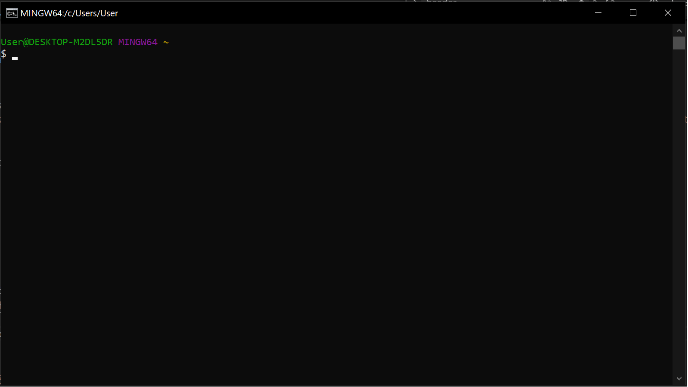
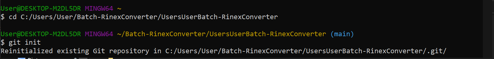

# Batch Rinex Converter

[](https://colab.research.google.com/drive/1_EEAtk_WzpY_h_sYny5qQ-sm7VuxEjtE?usp=sharing)

This project aims:
- convert an original batch script converter into a python based converter that converts leica/trimble raw data into Rinex data.
- add an interactive user interface that adds qol aspects to the converter for easy user access.

This github repository serves as a way for members to collaborate on the creation of the program.
Modes of input include:

1. Downloading the repository into their local computer and pushing updates through Git.

2. Google Colab code that can be updated alongside the "master" file for the program<sup>1

1 *For those opting to use this input, I trust you can set up the installers (i have no clue how to implement the script in colab). Any changes to the script in this way can be pushed by pinging me in messenger.*

---

## 📖 Table of Contents
- [Features](#features)
- [Prerequisites](#prerequisites)
- [Installation](#installation)
- [Usage](#usage)
- [Google Colab](#google-colab)
- [Contributing](#contributing)
- [License](#license)

---

## ✨ Planned Features (we can use this are as a sort of checklist to be edited when the program is finished.)
- Takes in raw GNSS data (.m** and .T02) and converts it into Rinex files 🔴 **87.5% done**
    - For leica sites (.m**) 🔴
        - recognize file type from zip - 100% done 🟢
        - unzip it in a separate folder - 100% done 🟢
        - open cmd to access mdb2rinex for conversion - 100% done 🟢
        - use gfzrnx to clean header, logging interval, version change, hatanaka - 25% done 🔴
        - zip all files from same station to 1 file with correct extension in an output folder - 100% done 🟢
        - handles multiple stations and start and end dates - 100% done 🟢

    - For trimble sites (.T02)<sup>2 🔴 **87.5% done**
        - recognize file type from zip - 100% done 🟢
        - unzip it in a separate folder - 100% done 🟢
        - open cmd to access convertToRinex for conversion - 100% done 🟢
        - use gfzrnx to clean header, logging interval, version change, hatanaka - 25% done 🔴
        - zip all files from same station to 1 file with correct extension in an output folder - 100% done 🟢
        - handles multiple stations - 100% done 🟢

- Supports Hatanaka compression 🔴
- Works with multiple Leica `.m00` and Trimble `.t02` files simultaneously 🔴
- Integrate a UI (preferably based on ver4\.3c ) to make the program user friendly 🟢|🔴 <sup>3

2 not debugged or tested  
3 we have a preliminary UI (ver4\.3C) w/o conversion logic integrated; since logic hasn't been integrated it is still incomplete

---

## 🛠 Prerequisites (**For code input**)

- Python 3.x installed
- Interpreter installed (VSCode, notepad++, etc.)
- Required utilities (`mdb2rinex`, `gfzrnx`, etc.) (have at least 15 mb free space for all required dependecies) refer to Installation for setup [prerequisites folder](prerequisites/)
- Google Colab (optional)
- Git (if opt to use github and edit files locally) See git push guide for details.

---

## 📦 Installation 

## • Local installation

1\. Make sure Git is installed.<br>
    - To install Git you may follow this guide starting @ 2:11 to 3:13
    [](https://youtu.be/tRZGeaHPoaw?si=NV-0TO8qYmWDUhnu&t=131)

Once Git is installed, open Git Bash software. It should look like this:


2\. Download all files. And setup local git repository on local computer<br>
    - in the github repo, click on code and click download zip.
    
      

    - After download, unzip the folder into C:/Users/User*/Batch-RinexConverter. no need to rename the folder.  

  

3\. configure git bash. <br>
    - In order to push changes on the program, Git Bash must be comfigured so that the git repo created locally will be merged into the github repo.
    - For this, open Git Bash and type

```bash
git config -- global user.name "Your-Name"
```
Press enter, then type

```bash
git config -- global user.email "your up email (for ojt) or yung namria email niyo po maam"
```
Press enter.

    - To initialize your git repo (the on you downloaded)
    on the git bash cmd, type  

```bash
cd C:/Users/User/Batch-RinexConverter/Batch-RinexConverter-main
```


    - press enter and then type:

```bash
git init
```
    - now type:
```bash
git remote add origin https://github.com/Cyaltie/Batch-RinexConverter.git
```

## -


